>Jesús Ángel Martínez Mendoza | EDD | Ago - Dic, 2023
>>jesusangelmartinezmendoza0702@gmail.com
## Conceptos previos
### Grafos en Estructuras de Datos

Un **grafo** en informática es una estructura de datos que permite representar problemas del mundo real. Consta de:

- **Nodos** (también llamados vértices): son los elementos que forman parte del grafo. Pueden representar entidades reales como personas, lugares, etc.
- **Aristas** (también llamadas enlaces o aristas): conectan pares de nodos entre sí. Representan relaciones o interacciones entre los nodos. 

Los grafos se pueden representar visualmente conectando nodos mediante aristas. Por ejemplo:

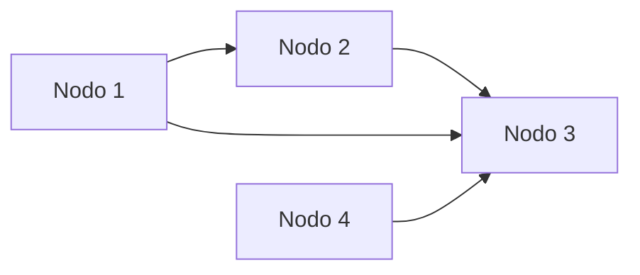

En este grafo, los nodos A, B, C y D están conectados por aristas que representan sus relaciones.

Los grafos son muy útiles en ciencia de la computación para:

- Modelar redes como el flujo de tráfico en carreteras, el tránsito aéreo, las redes sociales, etc.
- Representar el flujo de un programa.
- Modelar relaciones en bases de datos, inteligencia artificial, bioinformática, etc.

Los árboles son un tipo de grafo.

>Grafo: Conjunto de Nodos enlazados

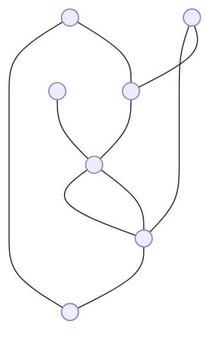

Grafos
- Dirigidos (Con sentido)
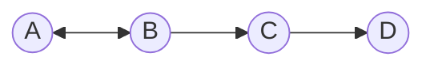

- No dirigidos
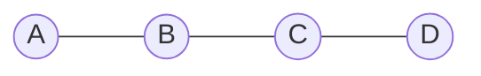
- Con peso (la relación posee un valor)
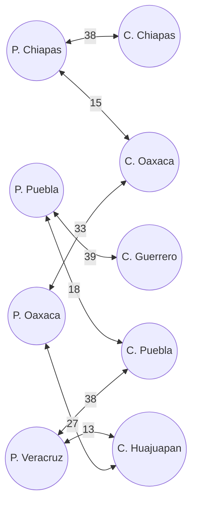


## Árbol
![[Pasted image 20231108204513.png]]
Un **árbol** es un tipo especial de grafo que tiene una estructura jerárquica y un nodo raíz del que derivan el resto de nodos. Consta de:

- **Nodo raíz:** es el nodo principal del que derivan todos los demás nodos. Sólo hay un nodo raíz.
- **Nodos:** son los elementos del árbol diferente de la raíz. Cada nodo se conecta con otro nodo de nivel superior.
- **Aristas:** conectan cada nodo con su nodo padre/superior. Representan la relación jerárquica.
- **Hojas:** nodos que no tienen nodos hijos.

Un árbol se representa de forma jerárquica:

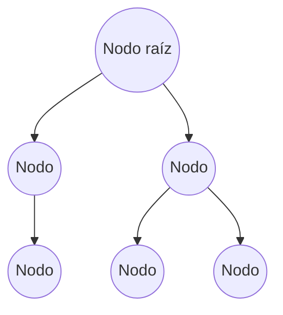

En este árbol, A es el nodo raíz. B, C son nodos derivados de A. D es hijo de B. E, F son hojas al no tener hijos.

Los árboles son útiles en informática para representar de forma jerárquica: 

- Estructura de archivos en un sistema operativo.
- El DOM (Document Object Model) que representa etiquetas anidadas en HTML. 
- Motor de búsqueda de rutas, IA en juegos, etc.

#### Búsquedas
En nuestro caso, usaremos una de sus utilidades que son la realización de búsquedas.

>Se representan mediante Nodos o incluso arreglos (Aquí se llaman montículos).

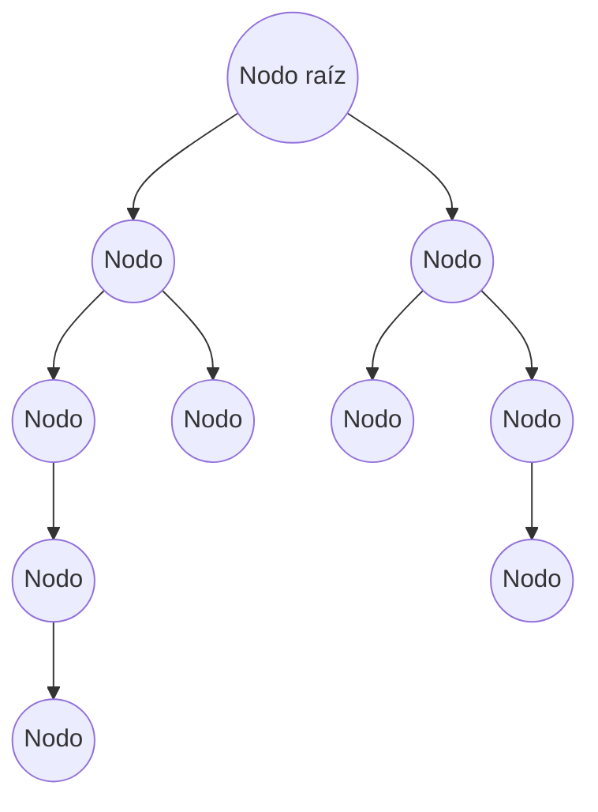


#### Forma
Una característica importante es que...
- Todos los de la izquierda son menores
- Los de la derecha son mayores
Para poder representar un árbol en un arreglo tiene que tener de forma triangular (que todos los Nodos estén ordenados), ya que los menores están a la izquierda.
![[Pasted image 20231108203125.png]]
>Por ejemplo las dos primeras figuras son correctas, pero la última no.

#### Árboles ordenados
Se necesita que estén ordenados para que al  al momento de rellenar el arreglo se llene de forma completa, sin espacios vacíos.

Por ejemplo si  tenemos el siguiente grafo
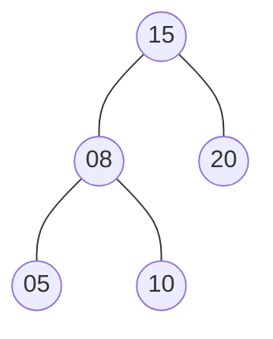

En el arreglo queda...
~~~
| 15 | 8 | 20 | 5 | 10 |...
~~~

Si no está ordenado generan espacios vacíos
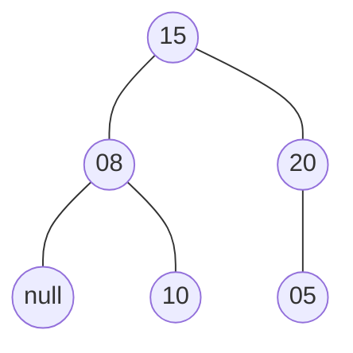

En el arreglo queda...
```
| 15 | 8 | 20 | 10 |   | 5 |...
```

Para ver el espacio en el arreglo 

| $n$ | Izquierda: $2n+1$ | Derecha: $2n+2$|
|---|---|---|
|0|1|2|
|1|3|4|
|2|5|6|
|...|...|...|

Para entender el cuadro anterior vea las posiciones $n$ con el valor del Nodo del siguiente esquema


En el arreglo queda...
~~~
| 15 | 8 | 20 | 5 | 10 |...
   0   1    2   3    4
~~~

La tabla muestra cómo se relaciona la posición de cada nodo en el árbol con su índice en el arreglo que lo almacena.

- El nodo raíz siempre está en la posición 0 del arreglo.
- El nodo hijo izquierdo está en la posición 2*n+1, donde n es la posición del nodo padre.
- El nodo hijo derecho está en la posición 2*n+2.

Esto permite recorrer y acceder eficientemente a los nodos del árbol en el arreglo.

>Un montículo es un árbol binario almacenado en un arreglo
## Codificación
```Java
public class ArbolBinario{
	private NodoArbol raiz; //Donde empieza el árbol
	//Metodo agregar
	public boolean buscarBool(Object o){
		//Recorremos por todo el Árbol
		NodoArbol aux = raiz;  //Inicio por la raiz
		NodoArbol ant = null;
		while(aux != null){ //Recorro mientras busco
			ant = aux;
			if(aux.getDato() == o){
				return true;
			}
			else{
				if((int) aux.getDato() < (int) o){
					aux = aux.getDerecha();	
				}
				else{
					aux = aux.getIzquierda();
				}	
			}
		}
		return false;
	}
	public Object buscarObject(Object o){
		//Recorremos por todo el Árbol
		NodoArbol aux = raiz, ant = null;  //Inicio por la raiz
		while(aux != null && aux.getDato() != o){ //Recorro mientras busco
			ant = aux;
			if((int) aux.getDato() < (int) o){
				aux = aux.getDerecha();	
			}
			else{
				aux = aux.getIzquierda();
			}	
		}
		return ant;
	}
	public boolean agregar(Object o){
		if(o == null){
			return false;
		}
		NodoArbol temp = (NodoArbol) buscarObject(o);
		if(temp == null){  //No hay nada, creamos
			raiz = new NodoArbol(o, null, null);
		}
		else{
			if((int) temp.getDato() == (int) o){
				return false;  //El dato ya existe
			}
			else{
				if((int) temp.getDato() > (int) o){ //Insertar por la izquierda
					temp.setIzquierda(new NodoArbol(o, null, null));
				}
				else{
					temp.setDerecha(new NodoArbol(o, null, null));	
				}
				return true;
			}
		}
		return false;  //Si todo falla
	}
}
```
- Los nodos no se repiten en los árboles.
- Una opción es agregar un atributo atrás, para manejar los repetidos.
- Hay un método para contar los Nodos del árbol.

### Métodos buscar, insertar, recorrer, eliminar...

>El Siguiente Esquemas de Nodos es correcto
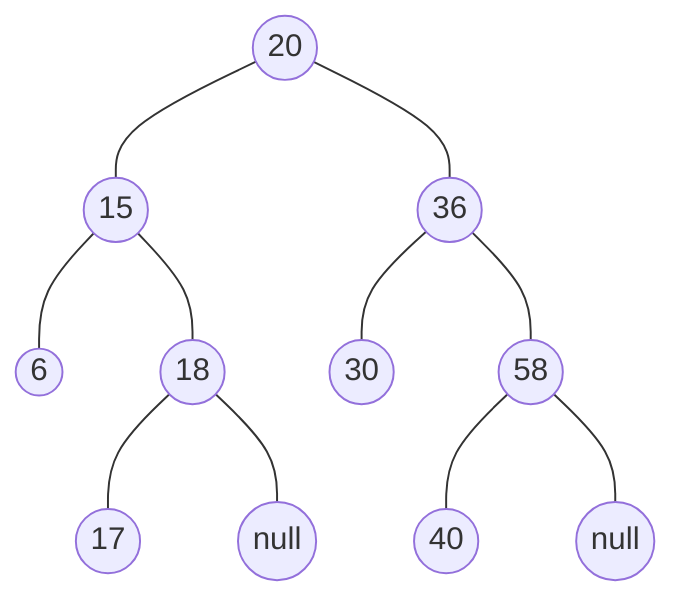

Al momento de recorrer, nos podemos dar cuenta que se repiten los pasos, y pueden ser recursivos, hasta llegar a un `null`.

Una operación es recorrer de forma... cada una es un método o una forma de recorrer.
1. `Inorden`
2. `Preorden`
3. `Postorden`

>Para hacer esto necesitamos usar la `raiz`, el cual es un privado

```Java
public void inorden(NodoArbol r){
	//...
}
```

Al usar una clase prueba
```Java error:5
public class Prueba{
	public static void main(String arg[]){
		ArbolBinario a = new Arbol();
		//Llamamos al método
		r.inorden(?); //AQUÍ NO SE PUEDEN ENVIAR NADA
	}
}
```

>El problema es como le pasamos la raíz, ya que es privada, no es posible

```Java important:5
public void ayudanteInorden(NodoArbol r){
	//Obtenemos r
}
public void inorden(){  //Sin recibir nada
	ayudantePosorden(r);  //Ya podemos trabajar con ella
}
```

El método ayudante nos ayuda a tener acceso a la clase, un problema que se presenta igual en [[Listas]], en uno de sus métodos.

>Esto es útil también en las bases de datos.
#### Inorden

```Java
	private void ayudanteInorden(NodoArbol r){
		//Obtenemos r
		if(r != null){
			ayudanteInorden(r.getIzquierda());
			System.out.print(" " + r.getDato());
			ayudanteInorden(r.getDerecha());
		}
	}
	public void inorden(){  //Sin recibir nada
		ayudanteInorden(raiz);  //Ya podemos trabajar con ella
	}
```
``
Ejemplo


Se imprime
```
| 6 | 15 | 17 | 18 | 20 | 30 | 36 | 40 | 58 |
```

>Recuerda lo importante de saber manejar de forma correcta los atributos.

>La diferencia entre las tres maneras de imprimir es donde va el imprimir, en el código.

#### Preorden
```Java
	private void ayudantePreorden(NodoArbol r){
		//Obtenemos r
		if(r != null){
			System.out.println(r.getDato());
			ayudantePreorden(r.getIzquierda());
			ayudantePreorden(r.getDerecha());
		}
	}
	public void preorden(){  //Sin recibir nada
		ayudantePreorden(raiz);  //Ya podemos trabajar con ella
	}
```

Ejemplo

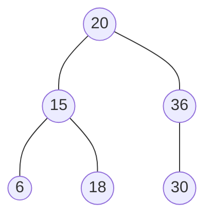
Se imprime
~~~
| 20 | 15 | 6 | 18 | 36 | 30 |
~~~
#### Postorden
```Java
private void ayudantePostorden(NodoArbol r){
		//Obtenemos r
		if(r != null){
			ayudantePostorden(r.getIzquierda());
			ayudantePostorden(r.getDerecha());
			System.out.println(r.getDato());
		}
	}
	public void postorden(){  //Sin recibir nada
		ayudantePostorden(raiz);  //Ya podemos trabajar con ella
	}
```

Ejemplo

Se imprime
~~~
| 6 | 18 | 15 | 30 | 36 | 20 |
~~~

- Agregar recursivo
#### Contar Hojas
Contar el número de hojas
```Java
	private int ayudanteContarHojas(NodoArbol r) {
		if (r == null) {  //Si noy nada
			return 0;
		}
		if (r.getIzquierda() == null && r.getDerecha() == null) {
			return 1;
		}
		return ayudanteContarHojas(r.getIzquierda()) + ayudanteContarHojas(r.getDerecha());
	}
	public int contarHojas() {
		return ayudanteContarHojas(raiz);
	}	
```

#### Contar Nodos
```Java
    // Método auxiliar recursivo para contar los Nodos
    private int contarNodos(NodoArbol nodo) {
        if (nodo == null) {
            return 0;
        }
        // Recorrer en inorden (izquierda - raíz - derecha)
        int contadorIzquierda = contarNodos(nodo.getIzquierda());
        int contadorDerecha = contarNodos(nodo.getDerecha());
        // Sumar el nodo actual
        return contadorIzquierda + contadorDerecha + 1;
    }
	public int contarNodos() {
        return contarNodos(raiz);
    }
```

>Nótese la sobrecarga de métodos en `contarElementos()`.
#### Contar Padres
```Java
	public int contarPadres(){
		return contarNodos() - contarHojas();
	}
```

#### Agregar De forma recursiva
```Java
	private boolean agregarRecursiva(Object o, NodoArbol n){
		if((int) n.getDato() > (int) o){  //Izquierda
			if(n.getIzquierda() == null){  //No hay nada
				n.setIzquierda(new NodoArbol(o, null, null));
				return true;
			}
			else{
				return agregarRecursiva(o, n.getIzquierda());
			}
		}
		else{  //Derecha
			if(n.getDerecha() == null){  //No hay nada
				n.setDerecha(new NodoArbol(o, null, null));
				return true;
			}
			else{
				return agregarRecursiva(o, n.getDerecha());
			}
		}
	}
	public boolean agregarRecursiva(Object o){
		if(o == null || buscarBool(o)){  //Objeto no válido o Ya existe el dato
			return false;
		}
		else{
			if(raiz == null){  //Árbol vacío
				raiz = new NodoArbol(o, null, null);
				return true;
			}
			else{  //Agregar a árbol con datos
				return agregarRecursiva(o, raiz);
			}
		}
	}
```

>14/11/2023


#### Eliminar
En realidad no elimina, lo que hace es modificar las referencias de los Nodos, con el fin de desligar el elemento que nos interesa, y a la vez reemplazándolo por un elemento hijo más cercano (con el fin de seguir teniendo las propiedades de un árbol).
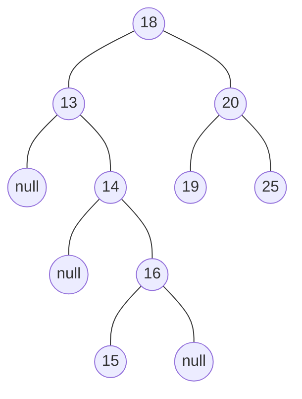

Generalidad: En este caso recorrer los Nodos sería super ineficiente y muy complicado de programar, lo que conviene es encontrar el Valor del Nodo cambiarlo por el más cercano (sin modificar las Ligas).
> Por ejemplo en la línea 28 y 31 de `eliminar` no modifica nada de las Ligas, ya que se vuelve a ligar nuevamente con el `aux`, y ejecuta al método solo para cambiar el valor del Dato y desligar solo un Nodo final (cercano). 

**Casos al borrar (eliminar) los Nodos**
- Tiene solo hijo derecho: Se mueve al derecho y lo reemplaza por ese.
- Tiene solo izquierdo: Se mueve al izquierdo y lo reemplaza por ese.
- Cuando es Hoja: Se borra la referencia y se cambia por `null`.
- Cuando tiene dos hijos: Busca al mas cercano a ella para reemplazarlo, no importa si es por derecha o izquierda.

Para eliminar un [[NodoArbol]] se pueden efectuar de forma general lo siguientes pasos...

|Método|Recibe|Retorna|Acción|
|----|------|------|-----|
|`eliminar`| `Object` | `boolean` | **Busca al Nodo **Objeto de encontrarlo manda a ese objeto a modificar las Ligas de sus Nodos usando el método `borrarNodo`|
|`borrarNodo` | `NodoArbol` | `NodoArbol` |**Modifica las referencias** Dado el Nodo recibido modifica las Ligas necesarias para eliminar o desligar el Nodo |

**Buscador del Nodo y Modificador de Padres**
1. Dar el objeto a buscar
2. Recorrer hasta llegar al Nodo de ese Objeto (Si no lo hay retorna `false`)
3. Si lo que queremos eliminar es la `raiz` manda a modificar la `raiz` en el método `eliminarNodo`
4. Si es otro Nodo cualquiera, para realizar las modificaciones de referencias necesarias el Nodo ligado actual solo cambia el Dato (No las ligas) y en el método `eliminarNodo` nos da el dato por el cual reemplazarlo y realiza la modificación.
5. De completar todo sin errores Retorna `true`.

```Java important1:28 important2:31
public boolean eliminar(Object o){
	//Recorremos el Árbol
	NodoArbol aux = raiz;
	NodoArbol ant = null;
	//Recorrer hasta llegar al dato o buscar
	while(aux != null){
		if((int)aux.getDato() == (int)o){
			break;  //Sale de la busqueda
		}
		else{  //Sigue buscando
			ant = aux;
			if((int)aux.getDato() > (int)o){
				aux = aux.getIzquierda();
			}
			else{
				aux = aux.getDerecha();
			}
		}
	}
	if(aux == null){  //Si no haya nada retorna false, no está el dato
		return false;
	}
	if(aux == raiz){  //Eliminar la raiz
		raiz = borrarNodo(aux);
	}
	else{
		if(ant.getIzquierda() == aux){  //Si el dato esta en la izquierda
			ant.setIzquierda(borrarNodo(aux));  //Cambiamos el Nodo
		}
		else{  //Si el dato esta en la derecha
			ant.setDerecha(borrarNodo(aux));  //Cambiamos el Nodo
		}
	}
	return true;
}
```

**Modificador de referencias en Hijos**
1. Recibe el Nodo enviado de `eliminar` si posee alguno de los hijos `null` retorna el otro hijo para que sea modificado (En este caso el padre).
2. Si posee ambos Hijos lo que hace es Buscar el Nodo que posee el valor más cercano al que se va a eliminar para reemplazarlo 
3.  Se cambian el valor de Dato de `n` para que tenga el valor más cercano.
4. Del Nodo donde se extrajo el valor más cercano se modifica su anterior para desligarlo.
5. Retorna el Nodo que recibió pero con un valor diferente `return n`.

```Java
private NodoArbol borrarNodo(NodoArbol n){
	//En estos primeros casos no se necesita una busqueda
	if(n.getIzquierda() == null){  //Si no hay nada a la izquierda
		return n.getDerecha();
	}
	if(n.getDerecha() == null){  //Si no hay nada a la derecha
		return n.getIzquierda();
	}
	//Si tiene dos Hijos, se debe buscar el más cercano
	NodoArbol aux = n.getDerecha();  //Aquí puede ser incluso Izquierdo
	NodoArbol ant = null;
	//Buscamos el más cercano al Nodo, buscando por Izquierda
	while(aux.getIzquierda() != null){  
		ant = aux;
		aux = aux.getIzquierda();
	}
	n.setDato(aux.getDato());  //Cambia el dato al más cercano*****************
	if(ant != null){
		//ant cambia su valor al único hijo de aux (Der), ya que no hay mas Izq
		ant.setIzquierda(aux.getDerecha());  
	}
	else{  //Este se ejecuta para la raíz, ya que ant == null
		//Cambia la derecha por que ya no hay izquierdas
		n.setDerecha(aux.getDerecha()); 
	}
	return n;  
}
```

>No importa si en el código anterior en la línea 10 tomas izquierda o derecha, es lo mismo, ya que por ambos lados el valor es válido, (ambos son el más cercano).
#### Borrar todo
```Java
public void eliminarTodo(){
	raiz = null;
}
```

>15/11/2023

#### Buscar recursivo
Desde el `Main`
```Java
	public boolean buscarNodo(Object o){
		return buscarNodo(o, raiz);
	}
```

Para el uso de `raiz`.
Salida recursiva `aux != null` o encuentre el objeto.
```Java
	public boolean buscarNodo(Object o){
		return buscarNodo(o, raiz);
	}
```

```Java
	private boolean buscarNodo(Object o, NodoArbol aux){
		if(aux == null){
			return false;  //null
		}
		if(aux.getDato().equals(o)){
			return true;  //aux
		}
		if((int)aux.getDato() > (int)o){
			return buscarNodo(o, aux.getIzquierda());
		}
		else{
			return buscarNodo(o, aux.getDerecha());
		}
	}
```

NOTA: Usa un criterio de comparación para los casos para manejar el `(int)variable`
- Identificar salidas no recursivas.
- Se puede usar el mismo para insertar un Nuevo Nodo.
- Cuando se retorna un dato`return` de forma consecutiva, retorna el último ejecutado.

>16/11/2023

**Código Extra visto en clase*****
```Java
public boolean agregar(Object o){
	return agregar(raiz, o);
}
public boolean agregar(NodoArbol aux, Object o){
	if(aux == null){
		raiz = new NodoArbol(o, null, null);
		return true;
	}
	if(aux.getDato().equals(o)){
		return false;
	}
	if(aux.getDato() > o){
		if(aux.getIzquierda() == null){
			NodoArbol nuevo = new NodoArbol(o, null, null);
			aux.setIzquierda(nuevo);
			return true;
		}
		return agregar(raiz.getIzquierda(), o)
	}
	if(aux.getDerecha() == null){
		NodoArbol nuevo = new NodoArbol(o, null, null);
		aux.setDerecha(nuevo);
		return true;
	}
	return agregar(raiz.getDerecha(), o)
}
```

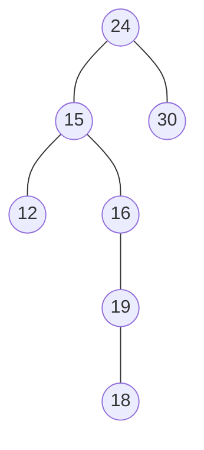

#### Eliminar de forma recursiva
Este código implementa la eliminación de un nodo en un árbol binario de búsqueda de manera recursiva, con comentarios para explicar cada sección.
- **eliminarRecursivo:** Esta función pública inicia la eliminación recursiva del elemento especificado desde la raíz del árbol.
- **eliminarRecursivo (función auxiliar):** Esta función realiza la eliminación recursiva del elemento desde el nodo actual del árbol.
- **findMinimum:** Encuentra el nodo con el valor mínimo en un subárbol, utilizado para encontrar el sucesor en caso de eliminar un nodo con dos hijos.
- **borrarNodoRecursivo:** Borra recursivamente un nodo del árbol y ajusta la estructura del árbol según los casos (sin hijos, un hijo, dos hijos).

```Java
	public Object eliminarRecursivo(Object o) {
		// Dato no válido, árbol no existente, o el elemento no se encuentra en el árbol
		if (o == null || raiz == null || !buscarBool(o)) {
			return null;
		}
		//Actualiza todo el Arbol
		raiz = eliminarRecursivo(o, raiz);
		return o;
	}
	private NodoArbol eliminarRecursivo(Object o, NodoArbol aux) {  // Función auxiliar para la eliminación recursiva de un nodo
		if (aux == null) {
			return null;
		}
		// Si el elemento a eliminar está en la raíz del subárbol actual
		if (aux.getDato().equals(o)) {
			// Llama a la función para borrar el nodo y ajusta el subárbol
			return borrarNodoRecursivo(aux);
		}
		// Verificar y eliminar en la rama derecha o izquierda
		if ((int) aux.getDato() < (int) o) {
			aux.setDerecha(eliminarRecursivo(o, aux.getDerecha()));  // Si el elemento es mayor, busca en la rama derecha
		} else {
			aux.setIzquierda(eliminarRecursivo(o, aux.getIzquierda()));  // Si el elemento es mayor, busca en la rama derecha		}
		return aux;
	}
	private NodoArbol findMinimum(NodoArbol nodo) {  //// Encuentra el nodo con el valor mínimo en un subárbol
		if (nodo == null) {
			return null;
		}
		// Itera hacia la izquierda hasta encontrar el nodo más pequeño
		while (nodo.getIzquierda() != null) {
			nodo = nodo.getIzquierda();
		}
		return nodo;
	 }
	private NodoArbol borrarNodoRecursivo(NodoArbol n) {  // Borra recursivamente un nodo del árbol y ajusta la estructura
		if (n == null) {
			return null;
		}
		// Caso: No hay nada a la izquierda
		if (n.getIzquierda() == null) {
			return n.getDerecha();
		}
		// Caso: No hay nada a la derecha
		if (n.getDerecha() == null) {
			return n.getIzquierda();
		}
		// Caso: Tiene dos hijos
		NodoArbol sucesor = findMinimum(n.getDerecha());  //Busca el sucesor en orden (valor mínimo en rama derecha)
		n.setDato(sucesor.getDato());  // // Actualiza el valor del nodo actual con el valor del sucesor
		n.setDerecha(eliminarRecursivo(sucesor.getDato(), n.getDerecha()));  //// Elimina recursivamente el sucesor en la rama derecha
		return n;
	}
```

